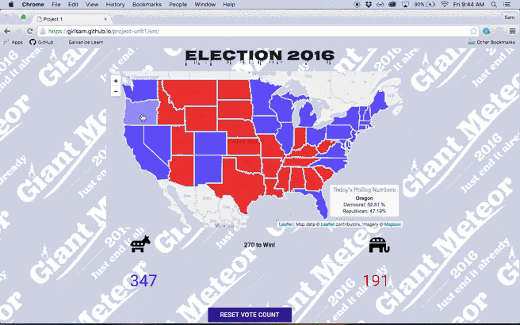

## Unit 1 Project
Updated August 12, 2016

#### Speculation 2016

The goal of this project was to take away all the noise surrounding the 2016 presidential election and replace it with real-time numbers.

To accomplish this distillation of data, I sought to create an interactive application that aggregates polling data from each state and displays this data on a choropleth map. The API powering this data is called PollyVote, which provides evidence-based election forecasting. It utilizes Leaflet Javascript library and GeoJSON data which is layered over a customized Mapbox map.

To review polling data, mouseover each state and watch the data populate in the bottom right corner of the map. These numbers also determine the coloring of each state on the map, and they determine the overall electoral total for each party. You can see these numbers populate dynamically below the map. If you want to see how different states can affect the total electoral votes, click on a state and watch the total dynamically change, as well.

This is not a finished product. The functionality to permanently change the state's color on-click isn't there, it only changes on hover and click. I would also like to add more to the styling of the page. The focus has been functionality over style.

See Demo Below:

